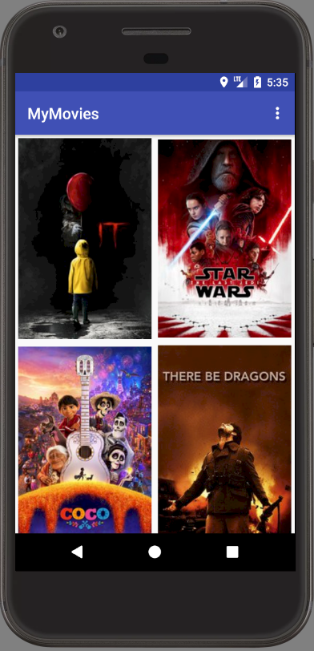

# MyMovies - Project 1 & 2

[Android Developer Nanodegree]: https://www.udacity.com/course/android-developer-nanodegree-by-google--nd801
[The Movie Database]: https://www.themoviedb.org
[Project Specifications]: https://review.udacity.com/#!/rubrics/67/view

Material design project done as part of **[Android Developer Nanodegree]** by Udacity.

Project 1:
Movies app that communicates with the internet and provides a responsive user experience. The app fetchs data from the Internet with the MovieDB API, use adapters and custom list layouts to populate list views, and incorporate libraries to simplify your code.

Project 2:
Expand on the movies app built in Project 1 to create a fully-featured app. This project will allow users to view and play trailers, read reviews, and mark their favorite movies. You’ll also create a database and content provider to store and handle your app data.


App's main screen:


     
## How to run the project

Please make sure you create keys.xml inside the \res\values\ folder, and also put your **[The Movie Database]** key in it as:
```sh
<string name="movie_key">YOUR_KEY_HERE</string>
```
    
**[Project Specifications]** 
